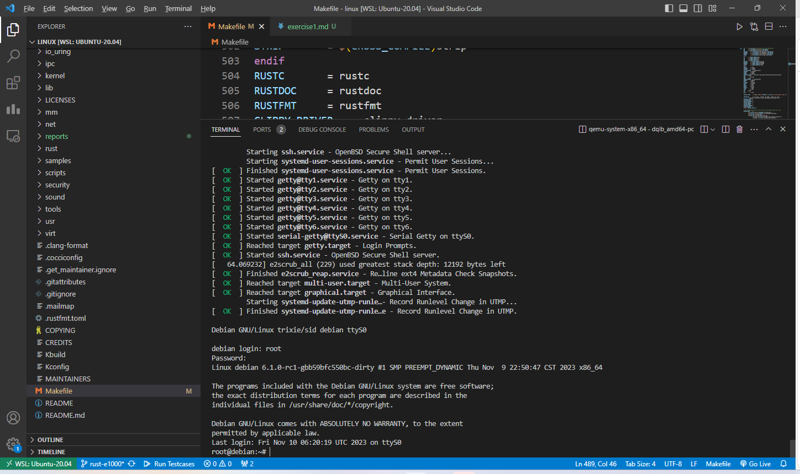

## 获取源码
一开始是想从官网clone，但是由于没有配置wsl走win代理，加上官网仓库体积很大，又看到群里大佬的博客的更快的下载方法，就照着这个方法了
```sh
git clone git@github.com:fujita/linux.git -b rust-e1000 --depth 1
```

## 配置环境
```sh
#其他工具
sudo apt-get -y install \
  binutils build-essential libtool texinfo \
  gzip zip unzip patchutils curl git \
  make cmake ninja-build automake bison flex gperf \
  grep sed gawk bc \
  zlib1g-dev libexpat1-dev libmpc-dev \
  libglib2.0-dev libfdt-dev libpixman-1-dev libelf-dev libssl-dev

#clang llvm
sudo apt install clang-format clang-tidy clang-tools clang clangd libc++-dev libc++1 libc++abi-dev libc++abi1 libclang-dev libclang1 liblldb-dev libllvm-ocaml-dev libomp-dev libomp5 lld lldb llvm-dev llvm-runtime llvm python3-clang

#由于我的wsl是Ubuntu20.04，默认下载的clang是10
#所以需要额外下载以满足要求
sudo apt install clang-12 lld-12

#rust
cd linux
rustup override set $(scripts/min-tool-version.sh rustc)
rustup component add rust-src
cargo install --locked --version $(scripts/min-tool-version.sh bindgen) bindgen #fujita版本不能加上-cli
make LLVM=1 rustavailable #等rust相关环境配置好了再检测
```

## 编译内核
### 修改Makefile配置
```makefile
486 CC		= clang-12#$(LLVM_PREFIX)clang$(LLVM_SUFFIX)
487 LD		= ld.lld-12#$(LLVM_PREFIX)ld.lld$(LLVM_SUFFIX)
```

### 配置内核支持rust并编译
配置内核支持rust
```sh
make ARCH=x86_64 LLVM=1 O=build defconfig

make ARCH=x86_64 LLVM=1 O=build menuconfig
#set the following config to yes
General setup
        ---> [*] Rust support
```

编译内核，这一步需要比较久
```sh
make ARCH=x86_64 LLVM=1 -j$(nproc)
```
运行完成如果有`./build/arch/x86_64/boot/bzImage`文件存在则代表编译成功

## 运行内核
### 下载qemu源码并配置编译
> 第二阶段只编译了riscv的版本，所以需要重新编译
```sh
wget https://download.qemu.org/qemu-7.0.0.tar.xz
tar xvJf qemu-7.0.0.tar.xz
cd qemu-7.0.0
./configure --target-list=x86_64-softmmu,x86_64-linux-user
make -j$(nproc)
```

在`~/.bashrc`中加入
```sh
export PATH="$HOME/os-env/qemu-7.0.0/build/:$PATH"
```

即可使用
```sh
qemu-system-x86_64
qemu-x86_64
```

### 下载debian系统镜像包并运行内核
- [debian镜像仓库](https://people.debian.org/~gio/dqib/)
```sh
wget https://gitlab.com/api/v4/projects/giomasce%2Fdqib/jobs/artifacts/master/download?job=convert_amd64-pc -O debian

cd dqib_amd64-pc

# 从readme.txt中复制并修改kernel目标文件
qemu-system-x86_64 -machine 'pc' -cpu 'Nehalem' -m 1G -drive file=image.qcow2 -device e1000,netdev=net -netdev user,id=net,hostfwd=tcp::22222-:22 -kernel ../build/arch/x86_64/boot/bzImage -initrd initrd -nographic -append "root=LABEL=rootfs console=ttyS0"
```

最后附上运行界面
