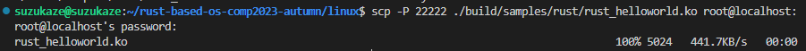
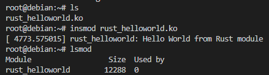

## 添加驱动模块本体
新建文件`./samples/rust/rust_helloworld.rs`，并写入
```rs
// SPDX-License-Identifier: GPL-2.0
//! Rust minimal sample.
    
use kernel::prelude::*;
    
module! {
type: RustHelloWorld,
name: "rust_helloworld",
author: "whocare",
description: "hello world module in rust",
license: "GPL",
}
    
struct RustHelloWorld {}
    
impl kernel::Module for RustHelloWorld {
fn init(_name: &'static CStr, _module: &'static ThisModule) -> Result<Self> {
    pr_info!("Hello World from Rust module");
    Ok(RustHelloWorld {})
}
}
```

## 修改Makefile和Kconfig
向`samples/rust/Makefile`添加
```makefile
obj-$(CONFIG_SAMPLE_RUST_MINIMAL)		+= rust_minimal.o
obj-$(CONFIG_SAMPLE_RUST_PRINT)			+= rust_print.o
//+++++++++++++++
obj-$(CONFIG_SAMPLE_RUST_HELLOWORLD)        += rust_helloworld.o
//+++++++++++++++

subdir-$(CONFIG_SAMPLE_RUST_HOSTPROGS)		+= hostprogs
```
向`samples/rust/Kconfig`添加
```
config SAMPLE_RUST_MINIMAL
tristate "Minimal"
help
    This option builds the Rust minimal module sample.

    To compile this as a module, choose M here:
    the module will be called rust_minimal.

    If unsure, say N.

//++++++++++++++++++++
config SAMPLE_RUST_HELLOWORLD
tristate "Print Helloworld in Rust"
help
    This option builds the Rust HelloWorld module sample.
    
    To compile this as a module, choose M here:
    the module will be called rust_helloworld.
    
    If unsure, say N.
//++++++++++++++++++++

config SAMPLE_RUST_PRINT
tristate "Printing macros"
help
    This option builds the Rust printing macros sample.

    To compile this as a module, choose M here:
    the module will be called rust_print.

    If unsure, say N.
```
## 修改配置选项并编译
注意除了最后一个选项按M表示编译为模块，其余选项按Y
```sh
make ARCH=x86_64 LLVM=1 O=build menuconfig

Kernel hacking --->
    [*]Sample Kernel code --->
        [*]Rust samples --->
            <M>Print Helloworld in Rust

make ARCH=x86_64 LLVM=1 O=build -j$(nproc)
```

## 将.ko文件加载进内核
编译完成后会出现文件`./build/samples/rust/rust_helloworld.ko`，启动内核虚拟机后，在宿主机scp将该文件传入虚拟机
```sh
scp -P 22222 ./build/samples/rust/rust_helloworld.ko root@localhost:
```


在虚拟机加载模块
```sh
insmod rust_helloworld.rs
```
