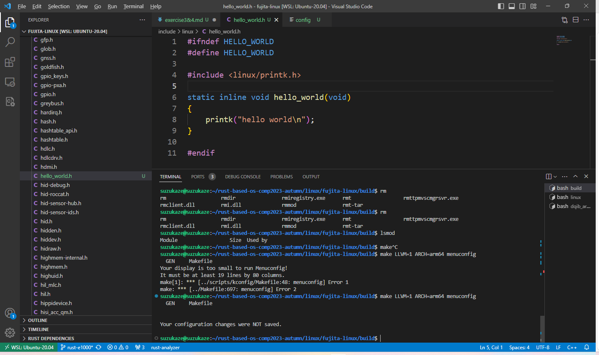
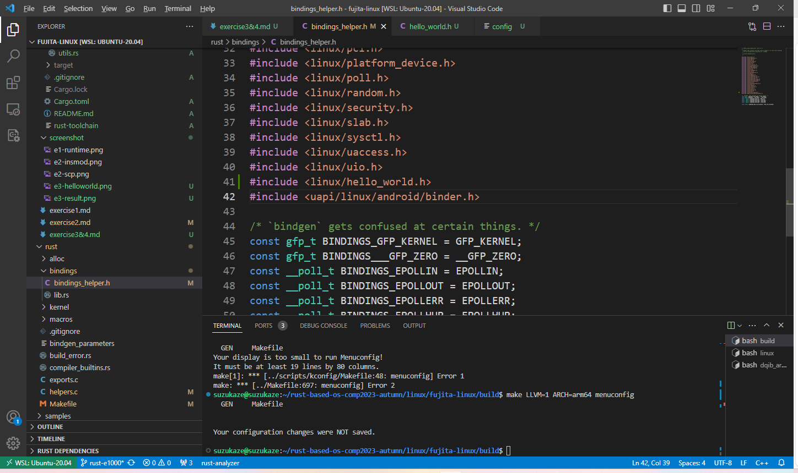
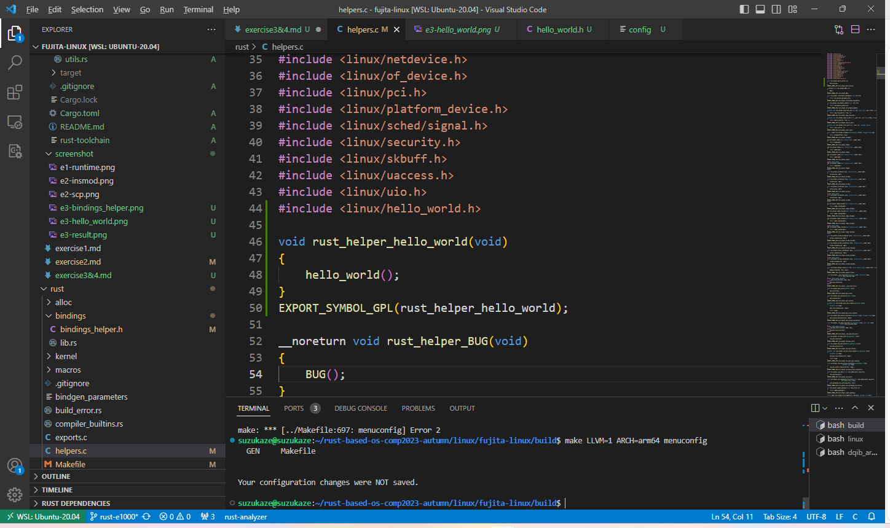
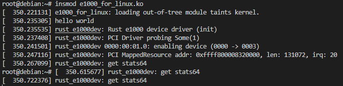
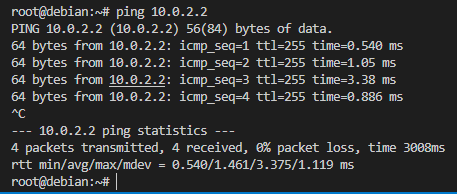
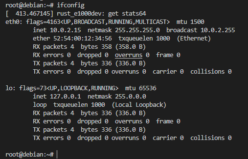
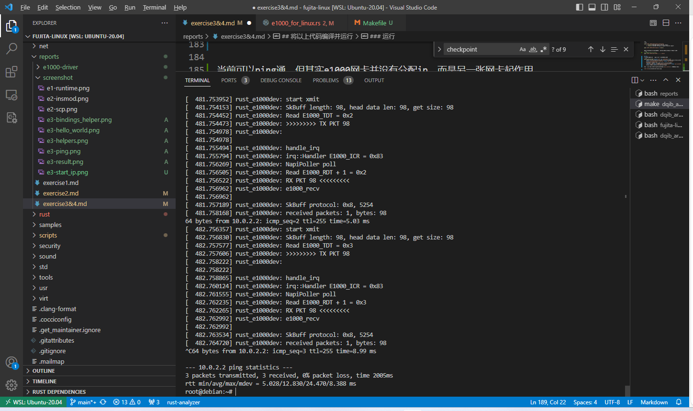

## 获取源码
- [e1000-driver](https://github.com/yuoo655/e1000-driver)
- [fujita-linux](https://github.com/fujita/linux/tree/rust-e1000)

## 自定义一个linux内核函数, 并在rust模块中调用它
新建文件`include/linux/hello_world.h`


在`rust/bindings/bindings_helper.h`添加头文件


在`rust/helpers.c`添加头文件、调用静态函数的代码以及导出代码


最后在网卡驱动`e1000-driver/src/e1000_for_linux.rs`中调用binding后的rust函数
```rs
impl kernel::Module for RustE1000dev {
    fn init(name: &'static CStr, module: &'static ThisModule) -> Result<Self> {
        //++++++++++++++
        unsafe {bindings::hello_world();}
        //++++++++++++++
        pr_info!("Rust e1000 device driver (init)\n");

        let dev = driver::Registration::<pci::Adapter<E1000Driver>>::new_pinned(name, module)?;
        Ok(RustE1000dev { dev })
    }
}
```

## 基于Qemu模拟器上的e1000网卡驱动框架，填充驱动初始化函数
### 完成Exercise3 Checkpoint 1-5
1,2是将内存物理地址映射为网卡pci地址
3,4是初始化网卡的寄存器
5是注册中断
```rs
// Exercise3 Checkpoint 1
// 分配tx_ring和rx_ring的内存空间并返回dma虚拟地址和物理地址
let (tx_ring_vaddr, tx_ring_dma) = kfn.dma_alloc_coherent(alloc_tx_ring_pages);
let (rx_ring_vaddr, rx_ring_dma) = kfn.dma_alloc_coherent(alloc_rx_ring_pages);

// Exercise3 Checkpoint 2
// 分配tx_buffer和rx_buffer的内存空间 并返回dma虚拟地址和物理地址
let (mut tx_mbufs_vaddr, mut tx_mbufs_dma) = kfn.dma_alloc_coherent(alloc_tx_buffer_pages);
let (mut rx_mbufs_vaddr, mut rx_mbufs_dma) = kfn.dma_alloc_coherent(alloc_rx_buffer_pages);

// Exercise3 Checkpoint 3
// set tx descriptor base address and tx ring length
self.regs[E1000_TDBAL].write(self.tx_ring_dma as u32);
self.regs[E1000_TDLEN].write((self.tx_ring.len() * size_of::<TxDesc>()) as u32);

// Exercise3 Checkpoint 4
// set rx descriptor base address and rx ring length
self.regs[E1000_RDBAL].write(self.rx_ring_dma as u32);
self.regs[E1000_RDLEN].write((self.rx_ring.len() * size_of::<RxDesc>()) as u32);

// Exercise3 Checkpoint 5
// Enable interrupts
// step1 set up irq_data
// step2 request_irq
// step3 set up irq_handler
let irq_data = Box::try_new(IrqData {
    dev_e1000: data.dev_e1000.clone(),
    res: data.res.clone(),
    napi: data.napi.clone(),
})?;
let handler = request_irq(33, irq_data)?;
data.irq_handler
    .store(Box::into_raw(Box::try_new(handler)?), Ordering::Relaxed);
```

### 完成Exercise4 Checkpoint 1-2
对这一块的逻辑不了解，基本是参照课上代码-_-
```rs
// Exercise4 Checkpoint 1
let mut packets = 0;
let mut bytes = 0;

let mut dev_e1k = data.dev_e1000.lock_irqdisable();
let recv_vec = dev_e1k.as_mut().unwrap().e1000_recv();

if let Some(vec) = recv_vec {
    packets = vec.len();
    for (_i, packet) in vec.iter().enumerate() {
        let mut len = packet.len();
        //bytes += len;

        let skb = dev.alloc_skb_ip_align(RXBUFFER).unwrap();
        let skb_buf =
            unsafe { from_raw_parts_mut(skb.head_data().as_ptr() as *mut u8, len) };
        skb_buf.copy_from_slice(&packet);

        skb.put(len as u32);
        let protocol = skb.eth_type_trans(dev);
        skb.protocol_set(protocol);

        // Send the skb up the stack
        napi.gro_receive(&skb);

        bytes += len;

        pr_info!(
            "SkBuff protocol: {:#x}, {:x}{:x}\n",
            protocol,
            skb_buf[0],
            skb_buf[1]
        );
    }
    pr_info!("received packets: {}, bytes: {}\n", packets, bytes);
} else {
    pr_warn!("None packets received\n");
}

data.stats.rx_bytes.fetch_add(bytes as u64, Ordering::Relaxed);
data.stats.rx_packets.fetch_add(packets as u64, Ordering::Relaxed);

// Exercise4 Checkpoint 2
skb.put_padto(bindings::ETH_ZLEN);
let size = skb.len() - skb.data_len();
let skb_data = skb.head_data();

pr_info!(
    "SkBuff length: {}, head data len: {}, get size: {}\n",
    skb.len(),
    skb_data.len(),
    size
);

dev.sent_queue(skb.len());

let mut dev_e1k = data.dev_e1000.lock_irqdisable();
let len = dev_e1k.as_mut().unwrap().e1000_transmit(skb_data);

if len < 0 {
    pr_warn!("Failed to send transmit the skbuff packet: {}", len);
    return net::NetdevTx::Busy;
}

let bytes = skb.len() as u64;
let packets = 1;

skb.napi_consume(64);

data.stats.tx_bytes.fetch_add(bytes, Ordering::Relaxed);
data.stats.tx_packets.fetch_add(packets, Ordering::Relaxed);

dev.completed_queue(packets as u32, bytes as u32);

net::NetdevTx::Ok
```

## 将以上代码编译并运行
### 编译
内核
```sh
make LLVM=1 ARCH=arm64 O=build menuconfig
    < > Intel(R) PRO/1000 Gigabit Ethernet support
    < > Intel(R) PRO/1000 PCI-Express Gigabit Ethernet support
    
make LLVM=1 ARCH=arm64 O=build -j$(nproc)
```

需要让内核编译后，bindgen生成添加的内核函数的rust代码后再编译网卡模块
```sh
#./e1000-driver/src/linux/
make LLVM=1 ARCH=arm64 KDIR=../../../build/
```

### 运行
启动内核，需要额外加一张网卡方便传入e1000驱动模块
```sh
qemu-system-aarch64 -machine virt -cpu cortex-a57 -m 1G\
    -device virtio-blk-device,drive=hd -drive file=image.qcow2,if=none,id=hd\
    -device virtio-net-device,netdev=net -netdev user,id=net,hostfwd=tcp::22222-:22\
    -nographic -append "root=LABEL=rootfs console=ttyAMA0"\
    -initrd initrd -device e1000,netdev=net0,bus=pcie.0 -netdev user,id=net0\
    -kernel $(ROOT)/build/arch/arm64/boot/Image
```
然后加载网卡驱动，可以看到内核函数打印的`hello world`与加载成功的网卡驱动


当前可以ping通，但其实e1000网卡并没有启用并且分配ip，而是另一张网卡起作用



所以需要先禁用eth0，启用eth1并配置ip
```sh
ifconfig eth0 down
ifconfig eth1 up
ifconfig eth1 10.0.2.20/24
```

然后就可以用e1000网卡ping通了
